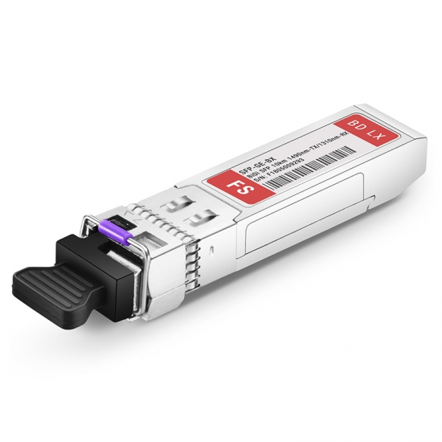
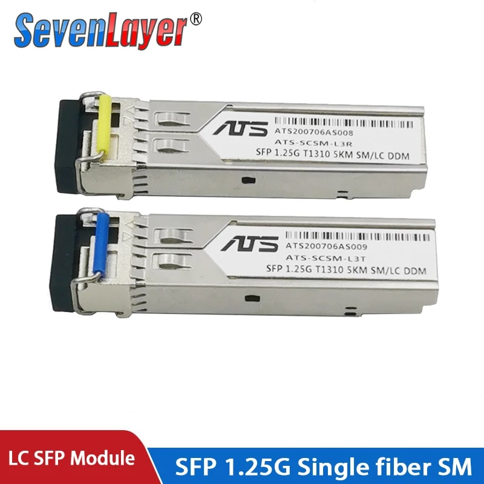
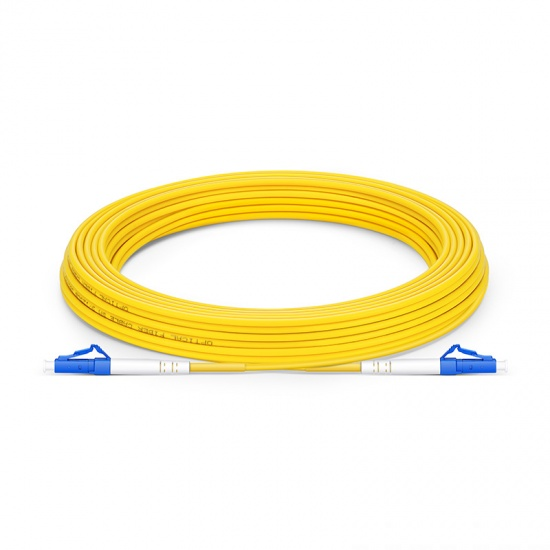
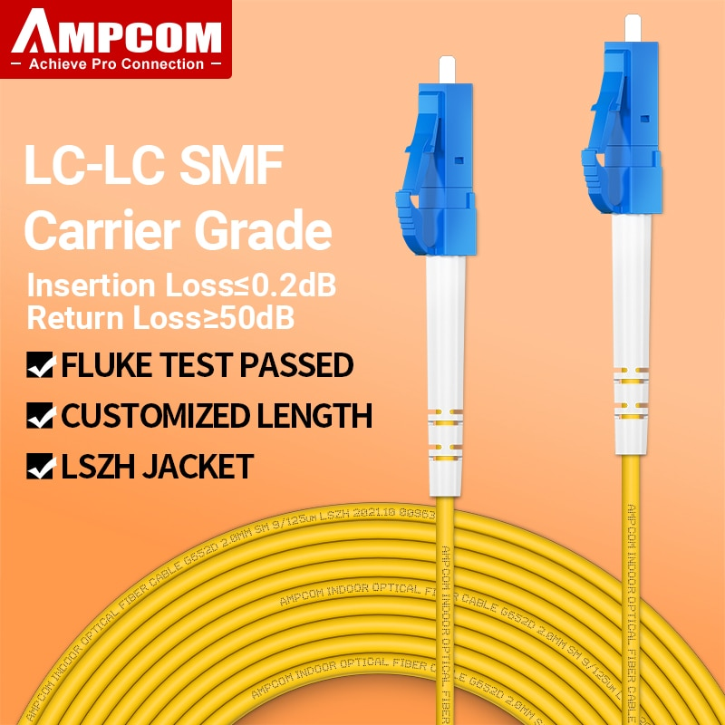

# Israeli FTTH Plan Technical Details

Fiber-to-the-Home (FTTH) in Israel is provided to private consumers by several different telecom companies:

  - [x] [Partner](#partner)
  - [x] [Bezeq](#bezeq)
  - [x] [Hot](#hot)
  - [ ] Cellcom
  - [ ] Unlimited


Each uses slightly different infrastructure and configurations. This repository documents the technical details for each telecom. Additionally, the goal for this repo is to provide details on the performance of each provider so that private customers can make smart decisions that consider which provider offers the best service.

This repository is still very much a work in progress, please feel free to add missing details.

## Partner

Partner markets their service as "private fiber" which means they use P2P instead of GPON. Effectively, most users do not notice significant performance speedup.

The fiber connection used is a single-mode simplex BiDi (WDM) LC/UPC fiber that uses 1490nm wavelength for TX and 1310nm for RX.

The reference SFP module that Partner provides is the [OPKAS1004](datasheets/OPKAS1004%20-%20DS_SFP-31W2Bah-DR(OPKAS1004)_SP.pdf).

User connections are usually configured as DHCP, but can also be set to PPPoE.

### Devices

| Image | Model | Description | Status |
| ----- | ----- | ----------- | ------ |
|  | [OPKAS1004](datasheets/OPKAS1004%20-%20DS_SFP-31W2Bah-DR(OPKAS1004)_SP.pdf) | SFP-31W2Bah(SM-10)-TX1490 RX1310-Purple | :heavy_check_mark: Reference |
|  | [FS.com #75336](https://www.fs.com/products/75336.html) | Generic Compatible 1000BASE-BX BiDi SFP 1490nm-TX/1310nm-RX 10km DOM LC SMF Transceiver Module | :heavy_check_mark: Tested |
|  | [FS.com #37925](https://www.fs.com/products/37925.html) | Customized 1000BASE-BX BiDi SFP 1490nm-TX/1310nm-RX 10km DOM Simplex LC/SC SMF Transceiver Module | :heavy_check_mark: Tested |
|  | [FS.com #11795](https://www.fs.com/products/11795.html) | Cisco GLC-BX-D Compatible 1000BASE-BX-D BiDi SFP 1490nm-TX/1310nm-RX 10km DOM Simplex LC SMF Transceiver Module | :heavy_check_mark: Tested |
|  | [AliExpress.com #32976142861](https://www.aliexpress.com/item/32976142861.html) | SevenLayer SFP Module 1.25G LC BiDi 1310nm/1550nm 20km | :heavy_check_mark: Tested |
|  | [FS.com #40442](https://www.fs.com/products/40442.html) | LC UPC to LC UPC Simplex OS2 Single Mode PVC (OFNR) 2.0mm Fiber Optic Patch Cable | :heavy_check_mark: Tested |
|  | [AliExpress.com #1005004782273257](https://www.aliexpress.com/item/1005004782273257.html) | AMPCOM LC to LC UPC Fiber Optical Patch Cable Singlemode Simplex SMF 9/125μm Single Mode 2.0mm Fiber Optic Cord | :heavy_check_mark: Tested |

## Bezeq

Bezeq deploys GPON networks that are able to support up to 2.5GBbps of bandwidth.

The fiber connection used is based on 1490nm TX / 1310nm RX GPON, and is usually terminated with LC APC ports.

Bezeq usually requires activation of ONTs and [publishes the following devices](datasheets/gpon.pdf) that are tested and "approved" for use:

```
                                                     3FE47111AGAA92
 Nokia       SFP ONT        G-010S-A      ALCL
                                                     3FE46398BGCB22
 Nokia       SFP ONT        G-010S-Q      ALCL       3FE49494AOCK21
  CIG        SFP ONT          G97-S       RSHF       R4.2.104.035a
  HT         SFP ONT       HT-25SPON      HTSP       V1.0.2.3
                                                     V1.3.4
Adtran      BRIDGE ONT       SDX611       ADTN
                                                     V1.3.5
                                                     3FE45655AOCK88
 Nokia      BRIDGE ONT     G-010G-P/Q     ALCL
                                                     3FE45655BOCK71
 ZTE        BRIDGE ONT        F601        ZTEG       V6.0.1P1T12
HALNY       BRIDGE ONT       HL-1GE       HALN       V2.0.22b
Heights
            CPE GW ONT       CPE-B2       HTBZ       BZG_360.1011
Telecom
Heights
            CPE GW ONT     HT-360AXG      HTXG       XF_360.13003
Telecom
Heights
            CPE GW ONT      HT-360AXI     HTYE       YES_H_1303
Telecom
 Accel      CPE GW ONT     FAST5670       SMBS       SGFs10000219
                                                     SGDg100000099
                                                     SGDg100000102
 Accel      CPE GW ONT     Fast5657IL     SMBS       SGDg100000106
                                                     SGDg100000108
                                                     SGDg100000119
 Accel      CPE GW ONT     Fast5670IL     SMBS       SGFz10000005
 Accel      CPE GW ONT     Fast5670IL     SMBS       SGFx10000017
                                                     SGFy10000075
 Accel      CPE GW ONT     FAST5670       SMBS
                                                     SGFy10000079
 Accel      CPE GW ONT    Fast5670V2IL    SMBS       SGFg12000016
 HALNY        CPE GW ONT         HL-4GQVS2         HALN     V3.0.18
Technicolor   CPE GW ONT          FGA2233          TMBB     2233.19.4.1
 HALNY        CPE GW ONT         HL-4GXV-F         HALN     V3.1.20p11
 HALNY        CPE GW ONT           HL-4GXV         HALN     V3.1.21t

```

ONT activation can be done only by Bezeq technicians on site or through their customer service, and requires the serial number of an approved device.

The Nokia G-010S-A has been partially reverse engineered as documented in https://github.com/hwti/G-010S-A (also see the [official datasheet](datasheets/ale-gpon-nokia-ont-g-010s-a-datasheet-en.pdf))

Another datasheet available is for the [CIG G97-S](datasheets/G-97S_DataSheet_V2.pdf)

There is a long thread at https://htmag.co.il/phpbb/viewtopic.php?f=62&t=367574 which documents usage of Bezeq GPON with custom 2.5G equipment (Hebrew) 

## Hot

Hot deploys GPON networks.

The fiber connection used is based on GPON, and is terminated with SC APC ports.

| Image | Model | Description | Status |
| ----- | ----- | ----------- | ------ |
|  | e.g. [Simplex patch cable](https://www.fiber-opticpatchcables.com/quality-11343201-simplex-2-25m-fiber-optic-patch-cables-g657b3-sc-apc-sc-apc-9-125-m-singlemode) | Fiber-optic patch cable G657B3 SC APC - SC APC 9 / 125μm Singlemode 3.0 mm | :heavy_check_mark: Reference |

## Other resources

- [HT magazine fiber forum](https://htmag.co.il/phpbb/viewforum.php?f=62)
- [ILFiber facebook group](https://www.facebook.com/groups/ILFiber)
