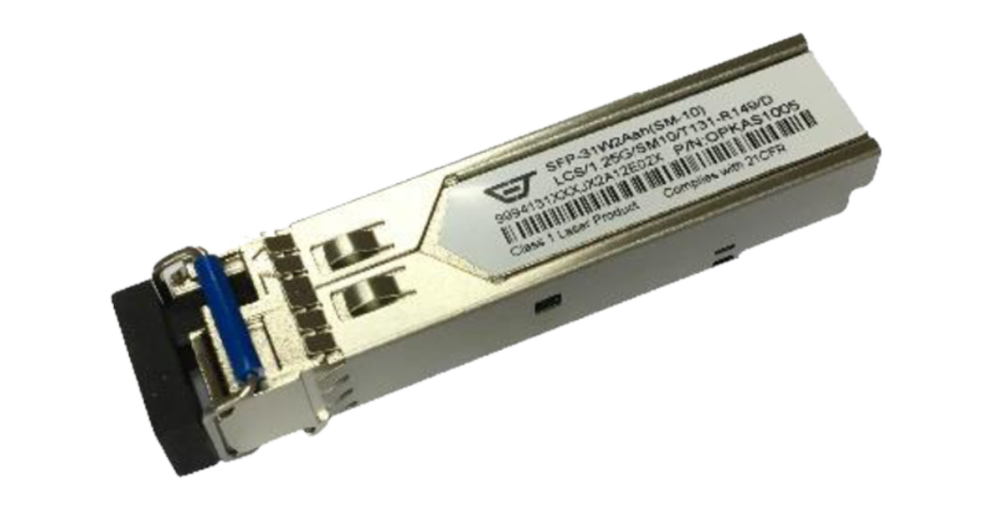
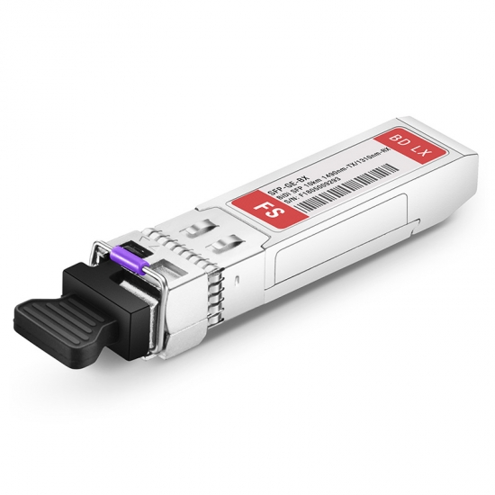
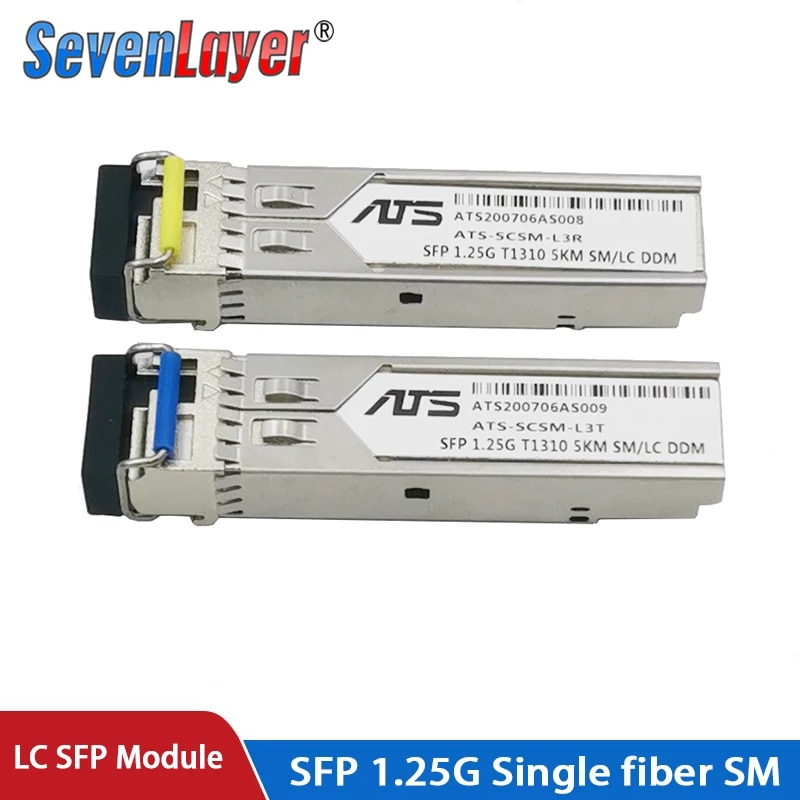
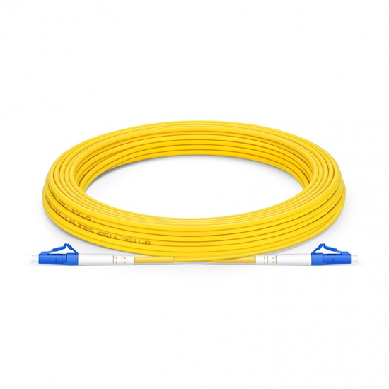
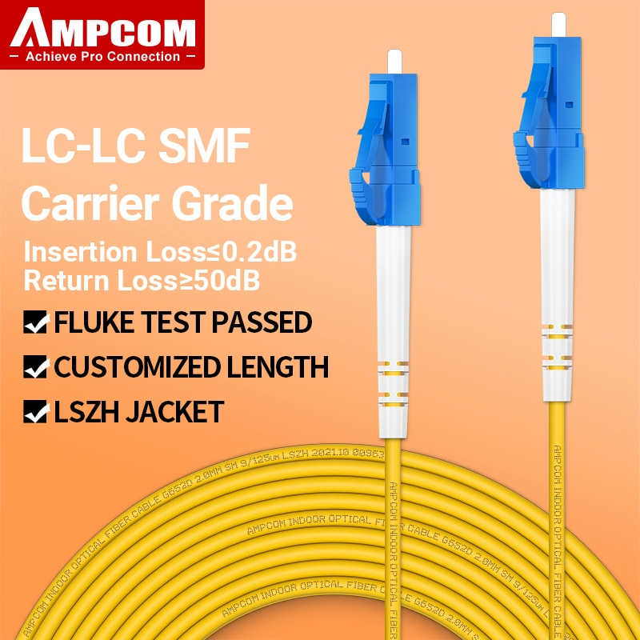
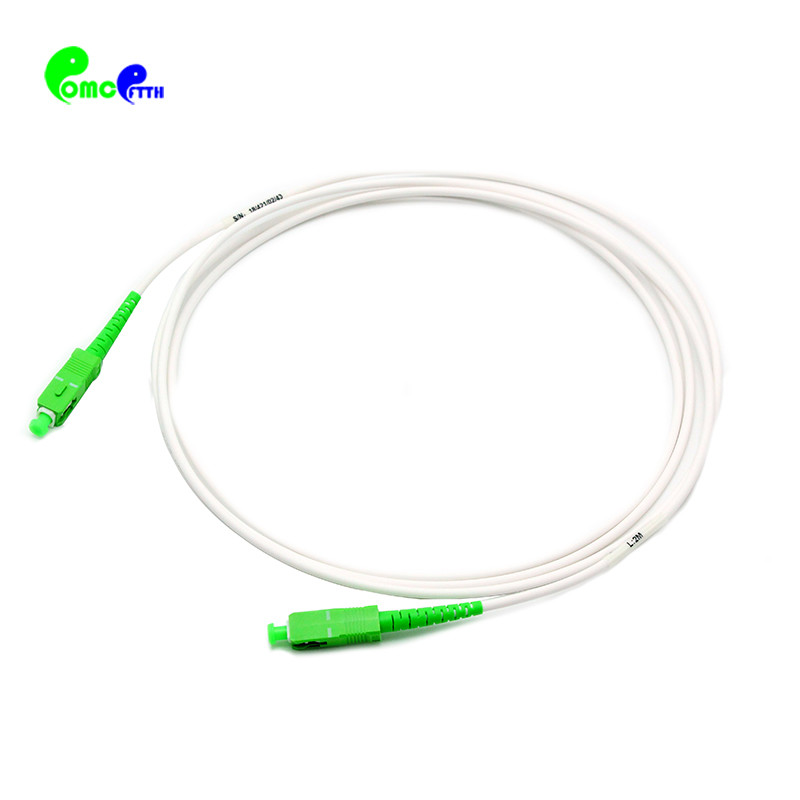

# Israeli FTTH Plan Technical Details

Fiber-to-the-Home (FTTH) in Israel is provided to private consumers by several different telecom companies:

  - [x] [Partner](#partner)
  - [x] [Bezeq](#bezeq)
  - [x] [Hot](#hot)
  - [ ] Cellcom
  - [ ] Unlimited

Each uses slightly different infrastructure and configurations. This repository documents the technical details for each telecom. Additionally, the goal for this repo is to provide details on the performance of each provider so that private customers can make smart decisions that consider which provider offers the best service.

This repository is still very much a work in progress, please feel free to add missing details.

## Partner

Partner markets their service as "private fiber" which means they use P2P instead of GPON. Effectively, most users do not notice significant performance speedup.

The fiber connection used is a single-mode simplex BiDi (WDM) LC/UPC fiber that uses 1490nm wavelength for TX and 1310nm for RX.

The reference SFP module that Partner provides is the [OPKAS1004](datasheets/OPKAS1004%20-%20DS_SFP-31W2Bah-DR(OPKAS1004)_SP.pdf).

User connections are usually configured as DHCP, but can also be set to PPPoE.

### Devices

| Image | Model | Description | Status |
| ----- | ----- | ----------- | ------ |
|  | [OPKAS1004](datasheets/OPKAS1004%20-%20DS_SFP-31W2Bah-DR(OPKAS1004)_SP.pdf) | SFP-31W2Bah(SM-10)-TX1490 RX1310-Purple | :heavy_check_mark: Reference |
|  | [FS.com #75336](https://www.fs.com/products/75336.html) | Generic Compatible 1000BASE-BX BiDi SFP 1490nm-TX/1310nm-RX 10km DOM LC SMF Transceiver Module | :heavy_check_mark: Tested |
|  | [FS.com #37925](https://www.fs.com/products/37925.html) | Customized 1000BASE-BX BiDi SFP 1490nm-TX/1310nm-RX 10km DOM Simplex LC/SC SMF Transceiver Module | :heavy_check_mark: Tested |
|  | [FS.com #11795](https://www.fs.com/products/11795.html) | Cisco GLC-BX-D Compatible 1000BASE-BX-D BiDi SFP 1490nm-TX/1310nm-RX 10km DOM Simplex LC SMF Transceiver Module | :heavy_check_mark: Tested |
|  | [AliExpress.com #32976142861](https://www.aliexpress.com/item/32976142861.html) | SevenLayer SFP Module 1.25G LC BiDi 1310nm/1550nm 20km | :heavy_check_mark: Tested |
|  | [FS.com #40442](https://www.fs.com/products/40442.html) | LC UPC to LC UPC Simplex OS2 Single Mode PVC (OFNR) 2.0mm Fiber Optic Patch Cable | :heavy_check_mark: Tested |
|  | [AliExpress.com #1005004782273257](https://www.aliexpress.com/item/1005004782273257.html) | AMPCOM LC to LC UPC Fiber Optical Patch Cable Singlemode Simplex SMF 9/125μm Single Mode 2.0mm Fiber Optic Cord | :heavy_check_mark: Tested |

## Bezeq

Bezeq deploys GPON networks that are able to support up to 2.5GBbps of bandwidth.

The fiber connection used is based on 1490nm TX / 1310nm RX GPON, and is usually terminated with LC APC ports.

Bezeq usually requires activation of ONTs (done over the phone through their technical support department) and [publishes the following devices](datasheets/gpon.pdf) that are "officially approved" for use (list updated by Bezeq on **16.08.2026**):

#### SFP ONTs

| Manufacturer | Model | Vendor ID | Technology | Approved firmware |
| --- | --- | --- | --- | --- |
| Nokia | G-010S-A | `ALCL` | GPON | `3FE47111AGAA92` `3FE46398BGCB22` |
| Nokia | G-010S-Q | `ALCL` | GPON | `3FE49494AOCK21` |
| CIG | G97-S | `RSHF` | GPON | `R4.2.104.035a` |
| HT | HT-25SPON | `HTSP` | GPON | `V1.0.2.3` |
| GO Fiber | G97-S | `DRCO` | GPON | `R4.2.104.049` |
| GO Fiber | GF25 | `GFBD` | GPON | `R4.2.104.049` |
| HALNY | HL-GSFP | `HALN` | GPON | `V1.0.9` |

#### Bridge ONTs

| Manufacturer | Model | Vendor ID | Technology | Approved firmware |
| --- | --- | --- | --- | --- |
| Adtran | SDX611 | `ADTN` | GPON | `V1.3.4` `V1.3.5` `V1.3.10` |
| Adtran | SDX611D | `ADTN` | GPON | `V2.3.8` |
| Adtran | SDX611Q | `ADTN` | GPON | `V2.3.12` |
| Adtran | SDX631 | `ADTN` | XGS-PON | `24_2-2-a` |
| Nokia | G-010G-P/Q | `ALCL` | GPON | `3FE45655AOCK88` `3FE45655BOCK71` |
| Nokia | G-010G-T | `ALCL` | GPON | `3FE49717AOCK12` |
| ZTE | F601 | `ZTEG` | GPON | `V6.0.1P1T12` |
| ZTE | F6005V3.0 | `ZTEG` | GPON | `V3.0.10P80N1` |
| HALNY | HL-1GE | `HALN` | GPON | `V2.0.22b` |
| HALNY | HL-1GE2 | `HALN` | GPON | `V2.0.22` |
| CDATA | FD511G-X-F660 | `CDGB` | GPON | `V1.3.8` |
| CDATA | FD511T-R460S | `CDTC` | XGS-PON | `V3.2.12` |
| CDATA | FD511H-R360 | `CDGB` | XGS-PON | `V3.0.4` |
| D-Link | DPN-101GR1 | `DLNK` | GPON | `RU_1.22-220225` |
| GO Fiber | GF25C | `GFBD` | GPON | `V1.9.0-231020` `V1.9.0-231108` `V1.9.0-240329` `V1.9.2-240924` |
| GO Fiber | GF10C | `GFBD` | XGS-PON | `R4.4.22C.008` |
| GO Fiber | GF10SK | `GFBD` | XGS-PON | `V1.0.10` `V1.0.14` |
| DZS | 5302 | `ZNTS` | XGS-PON | `V2.2.13` |

#### CPE Gateway ONTs

| Manufacturer | Model | Vendor ID | Technology | Approved firmware |
| --- | --- | --- | --- | --- |
| Heights Telecom | CPE-B2 | `HTBZ` | GPON | `BZG_360.1019` |
| Heights Telecom | HT-360AXG | `HTXG` | GPON | `XF_360.13003` |
| Heights Telecom | HT-360AXG | `HTGI` | GPON | `GI_360G.1003` |
| Heights Telecom | HT-360AXI | `HTYE` | GPON | `YES_H_1303` |
| HT | HT-360AXI-V2 | `HTRM` | GPON | `RI.360R.029` |
| HT | HTBCM370BE | `HTCM` | GPON | `CL_370BE.032` `CL_370BE.201` |
| Accel | FAST5670 | `SMBS` | GPON | `SGFs10000257` |
| Accel | FAST5670 | `SMBS` | GPON | `SGFy10000079` `SGFy10000093` `SGFy10000113` `SGFy10000149` `SGFy10000157` |
| Accel | Fast5657IL | `SMBS` | GPON | `SGDg100000108` `SGDg100000119` `SGDg100000122` |
| Accel | Fast5670IL | `SMBS` | GPON | `SGFz10000005` |
| Accel | Fast5670IL | `SMBS` | GPON | `SGFx10000017` `SGFx10000377` |
| Accel | Fast5670V2IL | `SMBS` | GPON | `SGFg12000032` `SGFg12000036` `SGFg12000060` `SGFg12000116` |
| Accel | FAST5674 | `SMBS` | GPON | `SGOg10000114` `SGOg10000180` |
| Accel | FAST5674 | `SMBS` | GPON | `SGUy10000067` |
| Accel | FAST5674 | `SMBS` | GPON | `SGOB610000008` |
| Accel | FAST5698IL | `SMBS` | GPON / XGS-PON | `SGMg30000042` `SGMg30000158` |
| HALNY | HL-4GQVS2 | `HALN` | GPON | `V3.0.18` |
| HALNY | HL-4GXV-F | `HALN` | GPON | `V3.1.20p11` `V3.99.1` |
| HALNY | HL-4GXV | `HALN` | GPON | `V3.1.21t` |
| Technicolor | FGA2233 | `TMBB` | GPON | `2233.19.4.1` `2233.19.5.1` `2233.19.5.2` |
| Vantiva | FGA232A | `TMBB` | GPON | `232A.23.2.1` `232A.23.2.2` |
| AVM GmbH | FRITZ!Box 5530 | `AVMG` | GPON | `08.25-133601` |
| AVM GmbH | FRITZ!Box 5590 | `AVMG` | GPON / XGS-PON | `08.25-133860` |
| AVM GmbH | FRITZ!Box 5690G | `AVMG` | GPON | `08.25-134002` |
| AVM GmbH | FRITZ!Box 5690X | `AVMG` | XGS-PON | `08.25-133396` |
| CDATA | FD504GW-DX-R471 | `CDGT` | GPON | `V2.4.10` `V3.2.19` |
| CDATA | FD614GS3-R850 | `CDTC` / `CDGT` | GPON | `V3.2.7` |
| CDATA | FD624TS3-R850 | `CDTC` | XGS-PON | `V3.2.24` |
| GO Fiber | GFD130 | `GFBD` | GPON | `V1.0.1.1` |
| GO Fiber | GFD172 | `GFBD` | GPON | `172_1.0.47` `172_1.0.64` `172_2.0.8` `172_2.0.11` `172_4.0.3` |
| GO Fiber | GFD172X | `GFBD` | XGS-PON | `172X_1.0.18` |
| GO Fiber | GFD430 | `GFBD` | GPON | `GFD430-V4.0.19` `GFD430-V4.0.30` |
| Opfibra | BT-G711AX | `XPON` | GPON | `V3.1.20p11` |
| Zyxel | PX5301-T0 | `ZYXE` | GPON | `V100ACKB0E1` |
| ZTE | F6705EV3.0.2 | `ZTEG` | GPON | `V3.0.10P80N1` |
| SAGEM | F@ST5674 | `PTIN` | GPON | `3GNX050200R06` |

Bezeq notes on the list:

- Equipment is approved **only** with the firmware version listed in the table; a product with modified software is not covered by the approval.
- Bezeq may disconnect or block a product that was not approved but is active on the network.
- The compatibility approval is not a "quality mark" for the product.

ONT activation can be done only by Bezeq technicians on site or through their customer service, and requires the serial number of an approved device.

The Nokia G-010S-A has been partially reverse engineered as documented in https://github.com/hwti/G-010S-A (also see the [official datasheet](datasheets/ale-gpon-nokia-ont-g-010s-a-datasheet-en.pdf))

Another datasheet available is for the [CIG G97-S](datasheets/G-97S_DataSheet_V2.pdf)

There is a long thread at https://htmag.co.il/phpbb/viewtopic.php?f=62&t=367574 which documents usage of Bezeq GPON with custom 2.5G equipment (Hebrew) 

## Hot

Hot deploys GPON networks.

The fiber connection used is based on GPON, and is terminated with SC APC ports.

| Image | Model | Description | Status |
| ----- | ----- | ----------- | ------ |
|  | e.g. [Simplex patch cable](https://www.fiber-opticpatchcables.com/quality-11343201-simplex-2-25m-fiber-optic-patch-cables-g657b3-sc-apc-sc-apc-9-125-m-singlemode) | Fiber-optic patch cable G657B3 SC APC - SC APC 9 / 125μm Singlemode 3.0 mm | :heavy_check_mark: Reference |

## Other resources

- [HT magazine fiber forum](https://htmag.co.il/phpbb/viewforum.php?f=62)
- [ILFiber facebook group](https://www.facebook.com/groups/ILFiber)
